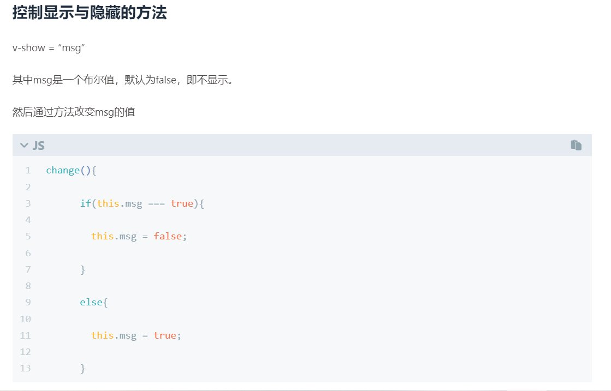

今天心血来潮翻看自己之前写的blog，发现了这么一段代码



看完之后有一种 【小丑竟是我自己】的感觉，之前一直看别人写的搞笑代码，乐在其中，没想到2年后的我翻看自己2年前写的代码，竟也出现了这种搞笑片段。。。。发现之后截图发给了我的好友，我说快出来看笑话，2年前我竟是这样写代码的。。。。好友说我简直人才。

往好了看，说明我进步了，怎么不是呢，狗头保命，改一个，以后看见别人写的搞笑代码也要返回来查一下自己之前是不是也是这么写的，下次再也不笑别人了。。。。

```js
change() {
    this.msg = !this.msg
}
``` 

第二个是发现自己博客的评论区好久没使用，都报错了
```
Code 504: The app is archived, please restore in console before use. [400 GET https://leancloud.cn/1.1/classes/Comment]
```
好久没用已经忘记自己之前用的什么插件了。查了自己的配置文件，发现是valine，百度一波发现是应用超过30天没有访问，被归档了，所以需要去官网重新激活一次。
参考链接： https://zhuanlan.zhihu.com/p/251040011
