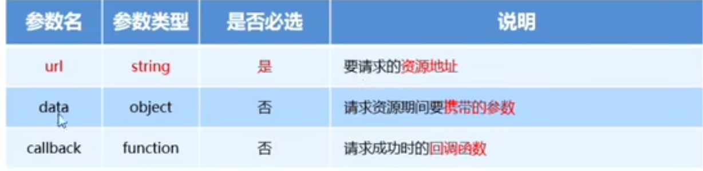
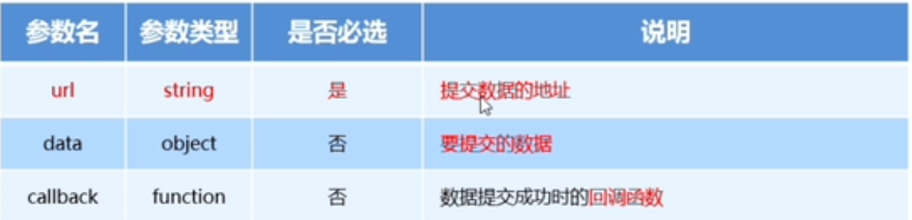
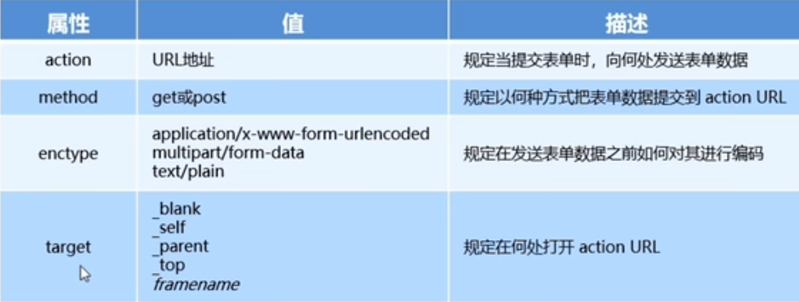
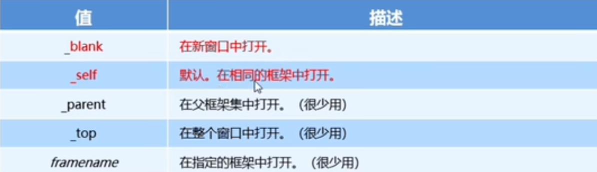
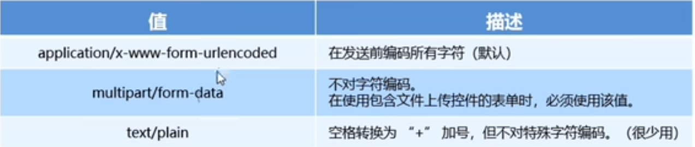

# ajax

网页请求数据的方法： var xhrObj = new XMLHttpRequest()

最常见的两种请求方式 get和post请求

get请求通常用于获取服务端资源（向服务器要资源）

例如：根据URL地址，从服务器获取HTML文件，css文件，js文件，图片文件，数据资源等

post请求常用于向服务器提交数据（往服务器发送资源）

例如：登录时向服务器提交的登录信息，注册时向服务器提交的注册信息，添加用户时向服务器提交的用户信息等各种数据提交操作

## jq中发起ajax请求的3个方法

$.get() 向服务器获取数据

$.post()  向服务器提交数据

$.ajax() 既可以向服务器获取数据又可以向服务器提交数据

### $.get()发起不带参数的请求
```
$.get(url,[data],[callback])
```


直接提供请求的url地址和请求成功的回调函数即可

```js
//这个代码的意思就是点击按钮就发起请求
$(function(){
            $('.btnGet').on('click',function(){
                $.get('http://www.liulongbin.top:3006/api/getbooks',function(res){
                    console.log(res);
                })
            })
        })
```

看结果在F12那边点network，切换为Feach/XHR就能看见请求结果
### $.get()发起带参数的请求

```js
$(function(){
            $('.btnGet').on('click',function(){
                $.get('http://www.liulongbin.top:3006/api/getbooks',{id:1},function(res){
                    console.log(res);
                })
            })
        })
```
### $.post()向服务器提交数据

$.post(url,[data],[callback])




```js
$(function(){
            $('.submit').on('click',function(){
                $.post('http://www.liulongbin.top:3006/api/addbook',{bookname:"海底两万里",author:"凡尔纳",publisher:"长江文艺出版社"},function(res){
                    console.log(res);
                })
            })
        })
```

ajax 发请求

```js
$.ajax({

type: ' ',    //请求的方式，例如GET或者POST(大写啊！！！)

url: ' ',      //请求的url地址

data: { },   //这次请求要携带的数据

success:function(res){ }      //请求成功之后的回调函数

})
```
如果你不需要携带参数，那么那个data就可以省略不写了，指的是整个都不要
# 表单

用于发送用户请求的

## 表单的组成部分

由三部分组成

1、表单标签 ```<form> </form>```

2、表单域 就是那些input框

包含了文本框，密码框，隐藏框，多行文本框，复选框，单选框，下拉选择框和文件上传框等。

3、表单按钮

## form标签的属性



### action

action属性用来规定当提交表单时，向何处发送表单数据

当form表单在未指定action属性值的情况下，action的默认值为当前页面的url地址

当表单提交后，页面会立即跳转到指定的url地址

### target

target属性规定在何处打开action url

他的可选参数有5个，默认情况下，target的值是_self



### method

method属性用来规定是以get方式还是post方式提交到action url

默认情况下，method值为get，表示通过url的形式提交数据，就是说你的数据会显示在url里面，然后post是通过F12看才能看见的，比较隐秘，一般用这个方式进行数据提交

get方式适合用来提交少量的，简单的数据

post方式适合用来提交大量的，复杂的，或包含文件上传的数据

### enctype



不涉及文件上传用默认值就行
## 通过ajax提交表单数据

### 监听表单提交事件
```
$('#form1').submit(function(e){

alert('叭叭叭');

})

法2：

$('form1').on('submit',function(){

alert('巴拉啊');

})
```
### 阻止表单默认提交行为
```
$('#form1').submit(function(e){

e.preventDefault();

})

$('form1').on('submit',function(e){

e.preventDefault();

})
```

### 快速获取表单中的数据

serializa()函数
```
$(具体选择器).serilize()
```
好处：可以一次性获取所有表单的数据

注意：在使用这个方法时，必须为每个表单元素添加name属性