# ajax

网页请求数据的方法： var xhrObj = new XMLHttpRequest()

最常见的两种请求方式 get和post请求

get请求通常用于获取服务端资源（向服务器要资源）

例如：根据URL地址，从服务器获取HTML文件，css文件，js文件，图片文件，数据资源等

post请求常用于向服务器提交数据（往服务器发送资源）

例如：登录时向服务器提交的登录信息，注册时向服务器提交的注册信息，添加用户时向服务器提交的用户信息等各种数据提交操作

## jq中发起ajax请求的3个方法

$.get() 向服务器获取数据

$.post()  向服务器提交数据

$.ajax() 既可以向服务器获取数据又可以向服务器提交数据

### $.get()发起不带参数的请求

$.get(url,[data],[callback])

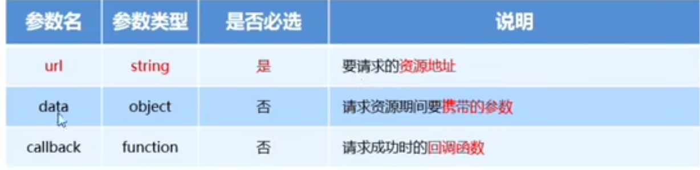

直接提供请求的url地址和请求成功的回调函数即可

```js
//这个代码的意思就是点击按钮就发起请求
$(function(){
            $('.btnGet').on('click',function(){
                $.get('http://www.liulongbin.top:3006/api/getbooks',function(res){
                    console.log(res);
                })
            })
        })
```

看结果在F12那边点network，切换为Feach/XHR就能看见请求结果

### $.get()发起带参数的请求

```js
$(function(){
            $('.btnGet').on('click',function(){
                $.get('http://www.liulongbin.top:3006/api/getbooks',{id:1},function(res){
                    console.log(res);
                })
            })
        })
```

### $.post()向服务器提交数据

$.post(url,[data],[callback])

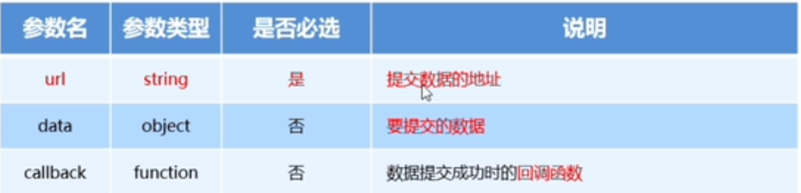

```js
$(function(){
            $('.submit').on('click',function(){
                $.post('http://www.liulongbin.top:3006/api/addbook',{bookname:"海底两万里",author:"凡尔纳",publisher:"长江文艺出版社"},function(res){
                    console.log(res);
                })
            })
        })
```

### $.ajax()发请求

$.ajax({

type: ' ',    //请求的方式，例如GET或者POST(大写啊！！！)

url: ' ',      //请求的url地址

data: { },   //这次请求要携带的数据

success:function(res){ }      //请求成功之后的回调函数

})

如果你不需要携带参数，那么那个data就可以省略不写了，指的是整个都不要

# 表单

用于发送用户请求的

## 表单的组成部分

由三部分组成

1、表单标签 <form> </form>

2、表单域 就是那些input框

包含了文本框，密码框，隐藏框，多行文本框，复选框，单选框，下拉选择框和文件上传框等。

3、表单按钮

## form标签的属性


### action

action属性用来规定当提交表单时，向何处发送表单数据

当form表单在未指定action属性值的情况下，action的默认值为当前页面的url地址

当表单提交后，页面会立即跳转到指定的url地址

### target

target属性规定在何处打开action url

他的可选参数有5个，默认情况下，target的值是_self

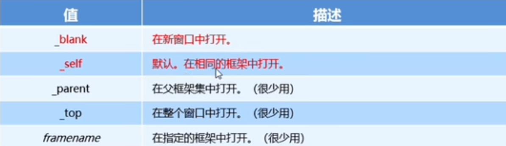

### method

method属性用来规定是以get方式还是post方式提交到action url

默认情况下，method值为get，表示通过url的形式提交数据，就是说你的数据会显示在url里面，然后post是通过F12看才能看见的，比较隐秘，一般用这个方式进行数据提交

get方式适合用来提交少量的，简单的数据

post方式适合用来提交大量的，复杂的，或包含文件上传的数据

### enctype

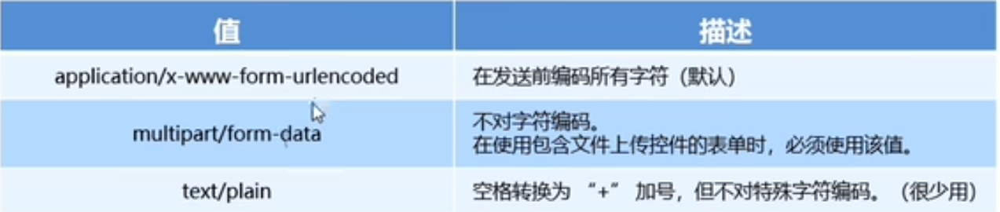

不涉及文件上传用默认值就行

## 通过ajax提交表单数据

### 监听表单提交事件

$('#form1').submit(function(e){

alert('叭叭叭');

})

法2：

$('form1').on('submit',function(){

alert('巴拉啊');

})

### 阻止表单默认提交行为

$('#form1').submit(function(e){

e.preventDefault();

})

$('form1').on('submit',function(e){

e.preventDefault();

})

### 快速获取表单中的数据

serializa()函数

$(具体选择器).serilize()

好处：可以一次性获取所有表单的数据

注意：在使用这个方法时，必须为每个表单元素添加name属性

# art-template模板引擎

## art-template的使用步骤

1、导入art-template

2、定义数据

3、定义模板

模板的html结构必须定义到script标签中，并且type="text/html"

4、调用template函数 ，要2个参数，第一个是模板的id，第二个是要渲染的数据对象

5、渲染HTML结构

## 标准语法

{{}} 在括号内可以进行变量输出，或者循环数组等操作

输出

变量{{value}}

如果是个对象{{obj.key}}

数组{{obj['key']}}

三元表达式{{a?b:c}}

或{{a||b}}

拼接{{a+b}}

### 原文输出

{{@ value}}

如果要输出的value值中，包含了html标签结构，则需要使用原文输出的语法，才能保证HTML标签被正常渲染。

### 条件输出

如果要实现条件输出，则可以在{{}}里面使用if.....else if....../if的方式，进行按需输出

{{if value}}按需输出的内容{{/if}}

{{if v1}}按需输出的内容{{else if v2}} 按需输出的内容 {{/if}}

{{if flag ===0}}

​    按需输出的内容

​    {{else}}

  按需输出的内容

​    {{/if}}

### 循环输出

在{{}}内通过each语法循环数组，当前循环的索引使用$index进行访问，当前的循环项使用$value进行访问

{{each arr}}

​	{{$index}}{{$value}}

{{/each}}

### 过滤器

过滤器的本质就是一个function处理函数

{{value | filterName}}

过滤器语法类似管道操作符，他的上一个输出作为下一个输入

template.defaults.imports.filterName = function(value){return处理的结果}

注意，一定要返回一个值，并且上面这个函数需要写在调用template函数之前

# xhr

## 基于xhr发起get请求

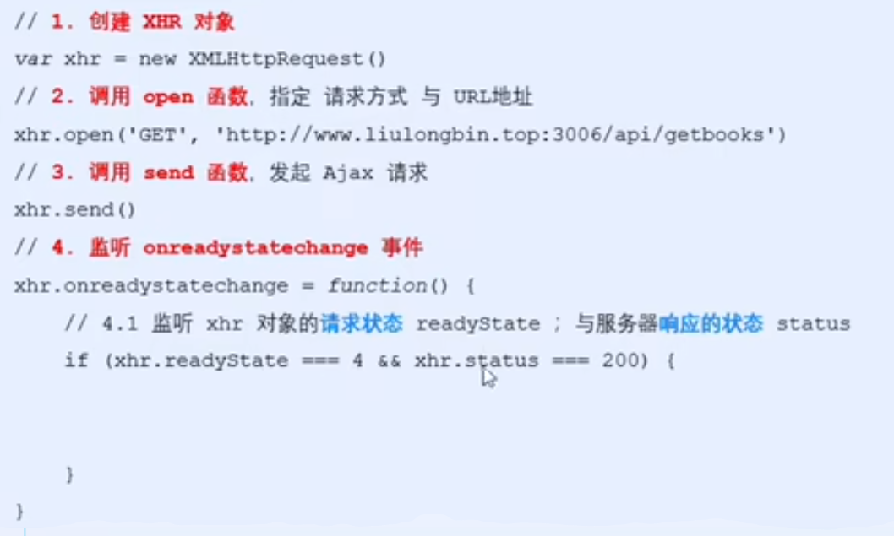

如果需要传递参数，则在open的路径后面?参数名=参数值

## url编码和解码

encodeURI() 编码的函数，就是中文变成三个%英文

decodeURI() 解码的函数，就是英文变成中文

##  使用xhr发起post请求

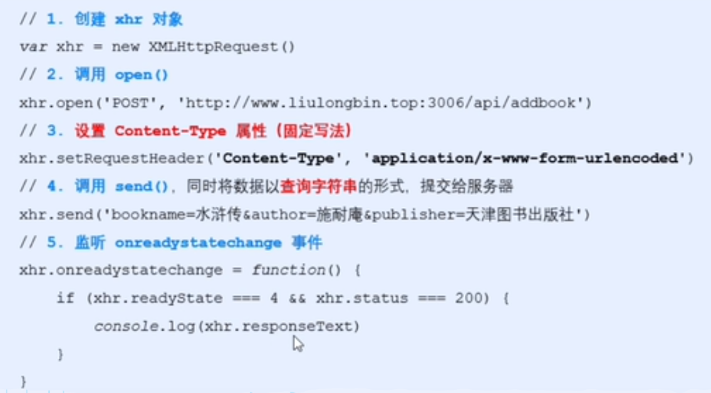

## 数据交换格式

### XML

<note>

​	<to>ls</to>

​	<from>zs</from>

​	<heading>通知</heading>

​	<body>晚上开会</body>

</node>

### JSON

本质：字符串

#### 两种结构

对象结构：对象结构用{}括起来，{key:value,key:value}的键值对结构。其中，key必须使用英文的双引号包裹的字符串，value的数据类型可以是数字、字符串、布尔值、null、数组、对象六种类型

不允许出现undefined和function

数组结构：数据结构在接送中表示为[]括起来的内容，数据结构为["","",""]数组中的数据类型可以是数字、字符串、布尔值、null、数组、对象六种类型

注：json中不能写注释，不允许使用单引号来表示字符串

## JSON和js对象的互相转换

1、实现json转换为js，用 JSON.parse()方法

2、实现js转换为json，用 JSON.stringify()方法

## xhr新功能

1、可以设置http请求的时限

xhr.timeout = xxx (单位是毫秒)

timeout事件

xhr.ontimeout = function(event){

函数体

}

2、可以使用FormData对象管理表单数据

(1)模拟表单操作，提交数据

```js
var fd = new FormData();
        fd.append('uname','haoye');
        fd.append('pwd','buhaole');
        var xhr = new XMLHttpRequest();
        xhr.open('POST','http://www.liulongbin.top:3006/api/formdata');
        xhr.send(fd);

        xhr.onreadystatechange = function(){
            if(xhr.readyState === 4 && xhr.status === 200){
                console.log(JSON.parse(xhr.responseText));
            }
        }
```

(2)也可以用来获取网页表单的值

详见37.html

3、可以上传文件

步骤：

（1）定义UI结构

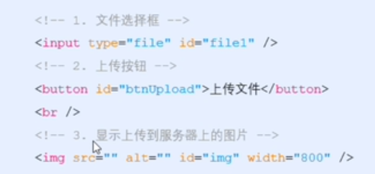

（2）验证是否选择了文件

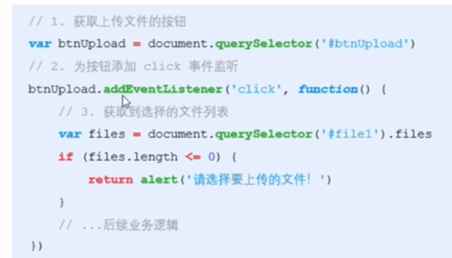

（3）向formdata追加文件

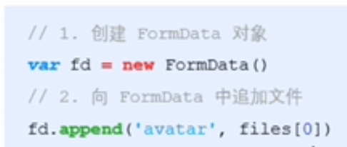

（4）发请求并监听

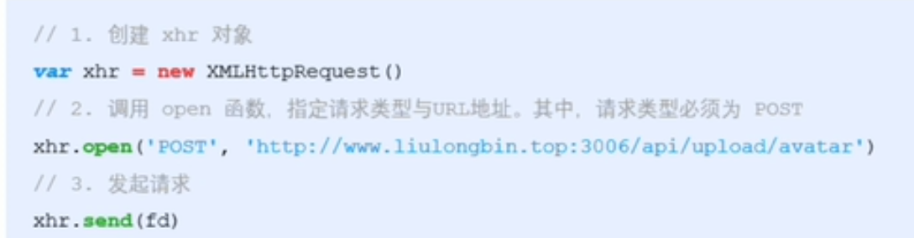

4、可以获得数据传输的进度信息

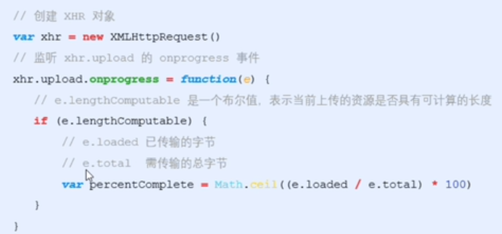

# axios

## 使用axios发起get请求

```js
var btn = document.querySelector('#btn1');
btn.addEventListener('click',function(){
var url = 'http://www.liulongbin.top:3006/api/get';
var data = {name:'zhanhu',age:20};
axios.get(url,{params:data}).then(function(res){
     console.log(res.data);
   })
 })
```


## 使用axios发起post请求

```js
var btn = document.querySelector('#btn2');
btn.addEventListener('click',function(){
var url = 'http://www.liulongbin.top:3006/api/post';
 var data = {address:'北京',location:'朝阳区'};
axios.post(url,data).then(function(res){
      console.log(res.data);
    })
 })
```

## 直接使用axios发起请求

详见41.html


只要调用某个方法的返回值是Promise示例，则前面可以添加await

await只能用在被async修饰的方法中

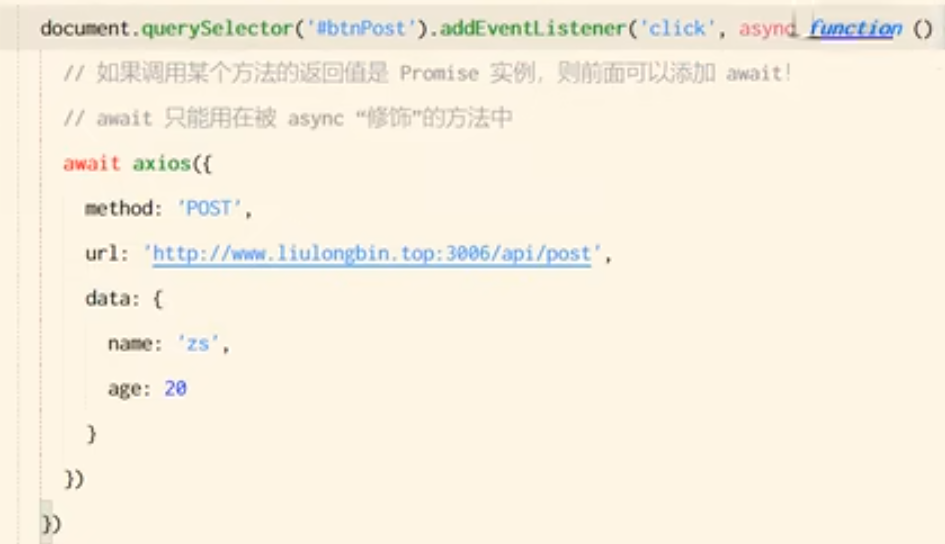

