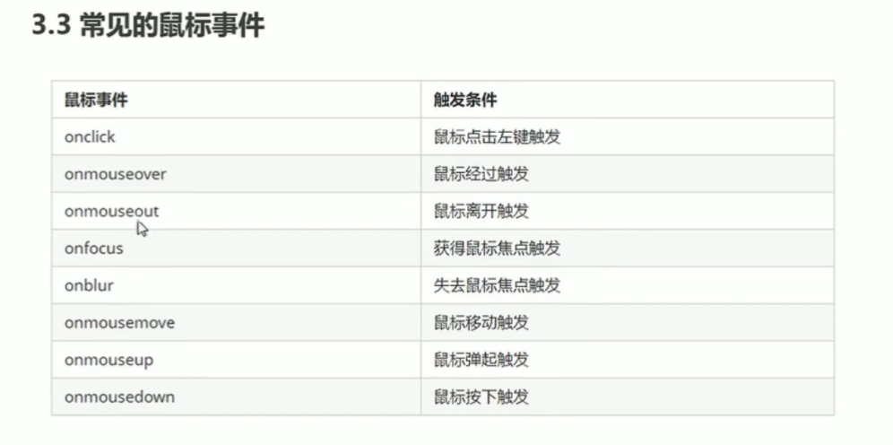
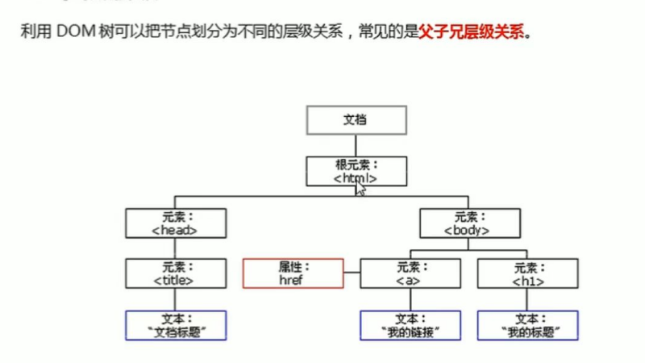
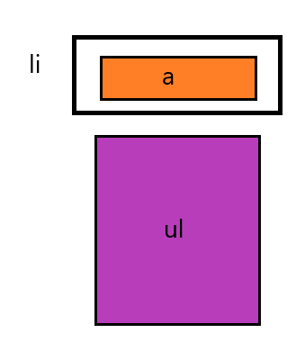
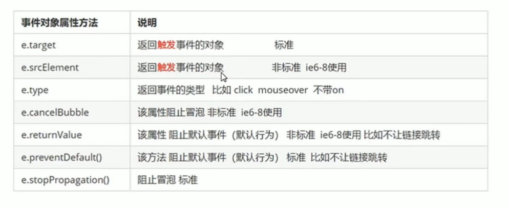
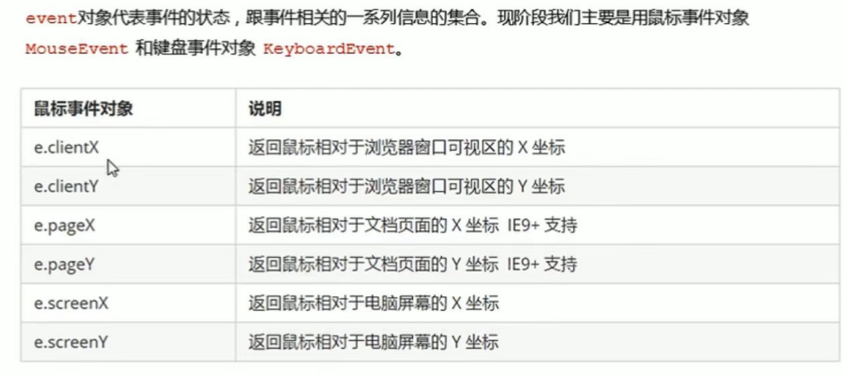
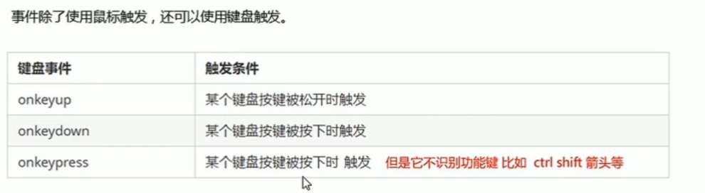
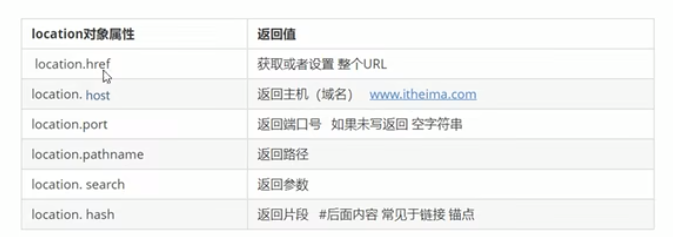
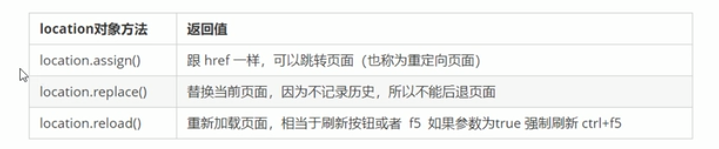
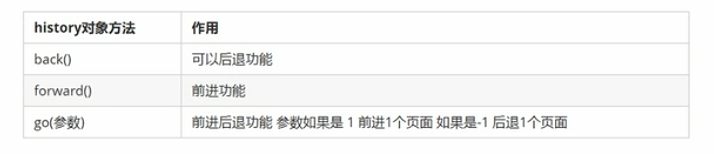

# DOM

<!--终于到这里了，好开心哈哈哈-->

## 获取页面元素

### 1、根据ID获取

`getElementById（'id名'）`：如果id是大小写敏感的DOM对象，若在当前Document下没有找到，则返回null

*ps：得现有元素，才有获取id选项，所以这个`getElementById（'id名'）`得写到标签的下面*

```javascript
<body>
    <div id="time">2019-9-9</div>
	<script>
        var timer = document.getElementById('time');
		console.log(timer);
	</script>
</body>
```

打印返回的元素对象：`console.dir(对象名)`

### 2、根据标签名获取

`getElementsByTagName('标签名')`:返回带有指定标签名对象的**集合**，以伪数组的形式存储。

如果想要依次打印里面的元素对象我们可以采取遍历的方式。

如果页面中只有一个目标标签，则返回一个伪数组，里面只有一个元素。

如果页面中没有目标标签，则返回一个空的伪数组。

得到的元素是动态的，就是说如果你原文的内容发生改变，获取到的内容也会相对应发生变化。

#### 2.1获取整个页面中所有的指定标签的元素

 `document.getElementsByTagName('标签名')；`

```javascript
var lis = document.getElementsByTagName('li');
console.log(lis);
console.log(lis[0]);
for(var i = 0;i<lis.length;i++)
{
	console.log(lis[i]);
}`
```

#### 2.2获取页面中某个元素内部所有指定标签的子元素

`element.getElementsByTagName('标签名')；`

*ps：父元素必须是单个对象，必须指明是哪一个元素对象，获取的时候不包括父元素自己*

```JavaScript
//代码功能：获取ol标签中所有li标签的内容
var ol = document.getElementsByTagName('ol');
console.log(ol[0].getElementsByTagName('li'));// 这个就是所谓必须指明哪一个元素对象
//一般如果要这么麻烦，还不如直接使用id法
```

### 3、通过html5新增的方法获取

#### 3.1通过类名来返回元素对象集合

`document.getElementsByClassName('类名')；`

#### 3.2根据指定选择器返回第一个元素对象

`document.querySelector('选择器')`：返回指定选择器的第一个元素对象

如何判断是什么选择器呢，用类加 .  id加 # 等能够区分出这是个什么标签的。

#### 3.3根据指定选择器返回所有的元素对象

`document.querySelectorAll('选择器')`:返回指定选择器的所有元素对象集合

```javascript
var a1 = document.getElementsByClassName('hei');
console.log('a1');
var b1 = document.querySelector('.box');
console.log('b1');
var c1 = document.querySelectorAll('.head');
console.log('c1');
```

### 4、特殊元素获取

#### 4.1 获取body元素

`document.body` :返回body元素对象

```JavaScript
var bodyEle = document.body;
console.log(bodyEle);
```

#### 4.2 获取html元素

`document.documentElement` ：返回html元素对象

```javascript
var htmlEle = document.documentElement;
console.log(htmlEle);
```

## 事件基础

事件三要素：事件源、事件类型、事件处理程序

事件源：获取元素

事件类型：鼠标点击，鼠标经过，键盘输入等

事件处理程序：通过一个函数赋值的方式

```javascript
//基本格式
var btn = document.getElementById('btn');
btn.onclick = function(){
	//你要执行的内容
}
```

常见的鼠标事件



### 禁止鼠标右键菜单

contextmenu主要控制应该何时显示上下文菜单，主要用于程序员取消默认的上下文菜单

```js
 document.addEventListener('contextmenu',function(e){
            e.preventDefault();
        })
```

虽然但是，你禁用了右键菜单我还是可以照常cv来复制文字啊

### 禁止鼠标选中

用selectstart

```js
 document.addEventListener('selectstart',function(e){
            e.preventDefault();
        })
```

嘿嘿，这下子你就cv不了了


## 获取元素

### 改变元素内容

element（某个元素名).innerText

从起始位置到终止位置的内容，但它去除html标签，同时空格和换行也会去除

element.innerHTML（用的多）

起始位置到终止位置的全部内容，包括html标签，同时保留空格和换行

这些是普通盒子，比如说div里面的标签才能用，input里面的value没办法通过这个获取

用法：如果是要让他点击按钮之后修改内容就写一个点击事件，element（某个元素名).innerText = 某个内容或者某个函数；如果是要让他页面一开始的时候就改变元素内容，就不用写事件了，直接获取变量然后写一个变量名.innerText = 某个变量或者函数 即可。

#### innerText和innerHTML的区别

1、innerText不识别html标签，如果你在里面写了<strong></strong>那么他会直接给你打印到屏幕上，去除空格和换行

2、innerHTML是识别html标签的，保留空格和换行

### 修改元素属性

1、先获取元素，然后注册事件，在事件里面改就行了，比如你想让图片切换，你就写img.src = '新路径';想改变图片标题就写img.title = '新标题'，以此类推

2、element.getAttribute('属性')  ps：element在实际应用中要改成你要修改的东西的名字

#### element属性和element.getAttribute的区别

前者获取内置属性值(元素本身自带的属性)

后者主要获得自定义的属性（标准），我们程序员自定义的属性

### 修改表单属性

所谓表单，指input框要改变他的value，或者value，checked，selected，disabled

表单里面的值，是通过value来修改的

input.value = '巴拉巴拉'；

让按钮禁用：btn.disabled = true;

### 修改样式属性

element.style 行内样式操作

element.className 类名样式操作

ps：element在实际应用中要改成你要修改的东西的名字

注意：js里面的样式采用驼峰命名法，js修改style样式操作，产生的是行内样式，css权重比较高
如果样式修改比较多，可以采取操作类名的方式更改元素样式。class因为是个保留字，因此使用className来操作元素类名属性。className会直接更改元素的类名，会覆盖原先的类名。如果想要保留原来的类名，就this.className = '原来的类名 新类名';

用法：第一种就很直接，在事件函数里面直接用，并且说明你要改变style里面的哪一块就行，第二个就是你得在css那边写一个样式，然后在事件函数里面让某个函数拥有这个类名。

### 设置属性值

element.属性 = ‘值’  //设置内置属性值

element.setAttribute('属性'，‘值’)  //主要针对自定义属性

注意：修改class属性的话，第一个要写className，第二个写class

ps：element在实际应用中要改成你要设置的东西的名字

### 移除属性

element.removeAttribute('属性')；

ps：element在实际应用中要改成你要移除的东西的名字

### H5自定义属性

自定义属性目的:为了保存并使用数据，有些数据可以保存在网页中而不需要保存到数据库中

#### 1、设置H5自定义属性

H5规定自定义属性用data-开头作为属性名并且赋值

e.g. <div data-index="1"></div>

或者用js来设置

e.g. element.setAttribute('data-index'.2)

ps：element在实际应用中要改成你要设置的东西的名字

#### 2、获取H5自定义属性的值

1）element.getAttribute('data-什么')

2）H5新增element.dataset.属性名或者element.dataset['属性名']

（用这种方法属性名不用加data-了）且只能用data-开头的，ie11以后才能用

dataset是一个集合，里面存放了所有以data-开头的自定义属性

注意：如果你是这么写的<div data-list-name="andy"></div>

那么你最后获取元素必须这么写： div.dataset.listName(必须驼峰命名法)

## 节点操作

——用于获取元素

节点的基本属性：nodeType（节点类型）、nodeName（节点名称）、nodeValue（节点值）

元素节点的nodeType为1

属性节点的nodeType为2

文本节点的nodeType为3（文本节点包含文字、空格、换行等）

在实际开发中，节点操作主要操作的是元素节点。

#### 节点层次



#### 父节点

parentNode

注意：得到的是离元素最近的父节点，如果找不到父节点就返回为null

#### 子节点

parentNode.childNodes

返回包含指定节点的子节点的集合，该集合为即时更新的集合，得到的是所有的子节点，包含元素节点和文本节点等，如果只想要得到里面的元素节点，则需要专门处理（for循环遍历，然后通过nodeType来判断是什么节点然后打印你想要的类型的节点），所以一般不推荐使用childNodes。

parentNode.children(重点，常用)

它是一个只读属性，返回所有的子元素节点，它只返回子元素节点，其余节点不返回。

ps：parentNode在实际应用中要改成具体的父节点名称

#### 获取第一个子元素或者最后一个子元素

法一

parentNode.firstChild //获取的是第一个子节点，不管是文本节点还是个元素节点

parentNode.lastChild //获取的是最后一个子节点，不管是文本节点还是元素节点

法二、

parentNode.firstElementChild //返回第一个子元素节点，找不到则返回null

parenNode.lastElementChild //返回最后一个子元素节点，找不到则返回null

注意：有兼容性问题，ie9以上才支持。

法三：（实际开发用这个）

parentNode.children[0] //得到第一个子元素节点

parentNode.children[parentNode.chileren.length - 1]

 ps：parentNode在实际应用中要改成具体的父节点名称 



下拉菜单的基本布局如上图所示


#### 兄弟节点

node.nextSibling //返回当前元素的下一个兄弟节点，找不到则返回null，同样，也是包含所有的节点

（node在实际开发中要换成你要的那个名字）

node.previousSibling //返回当前元素的上一个兄弟节点，找不到则返回null，同样，也是包含所有的节点

node.nextElementSibling //返回当前元素的下一个兄弟元素节点，找不到则返回null

node.previousElementSibling//返回当前元素的上一个兄弟元素节点，找不到则返回null

 ps：node在实际应用中要改成具体的节点名称 

上面两个都有兼容性问题，ie9以上才支持

解决兼容性问题的方法：自己封装一个兼容性函数

```JavaScript
function getNextElementSibling(element){
    var el = element;
    while(el=el.nextSibling){
        if(el.nodeType === 1){
            return el;
        }
    }
    return null;
}
```

#### 创建节点

document.createElement('tagName') //动态创建元素节点

#### 添加节点

node.appendChild(child) //将一个节点添加到指定父节点的子节点列表末尾，即为node添加一个孩子

node：父节点名 child：子节点名

node.insertBefore(child,指定元素) //将一个节点添加到指定父节点的子节点列表前面

 ps：node在实际应用中要改成具体的节点名称 

#### 删除节点

node.removeChild(child) //删除一个子节点，返回删除的节点

 ps：node在实际应用中要改成具体的节点名称 

#### 复制节点

node.cloneNode() //方法返回调用该方法的节点的一个副本，也称为克隆节点/拷贝节点

注：如果括号参数为空或者false，则为浅拷贝，即只克隆复制节点本身，不可隆里面的子节点（只获取标签，不复制里面的值）

深拷贝：复制标签包括复制里面的值node.cloneNode(true)

你复制完之后要告诉它把复制过来的标签放在哪里他才能显示出来。 

 ps：node在实际应用中要改成具体的节点名称 

#### 三种动态创建元素区别

document.write()（用的很少，了解）

element.innerHTML

document.createElement()

第一个是直接将内容写入页面的内容流，但是文档流执行完毕，则会导致页面全部重绘(即创建一个新页面写入你write的内容然后原先的东西全没了)

第二个是将内容写入某个dom节点，不会导致页面重绘，而且创建多个元素效率更高（不要拼接字符串，采取数组形式拼接），结构稍微复杂

第三个是创建多个元素效率稍低一点但是结构更清晰

总结：不同浏览器下，innerHTML效率要比createElement高

## 注册事件的两种操作

传统方式和方法监听注册方式

前者的特点是注册事件的唯一性，即同一个元素同一个事件只能设置一个处理函数，最后注册的处理函数将会覆盖前面注册的处理函数

后者，w3c标准，推荐方法，特点：同一个元素可以注册多个监听器，按注册事件以此执行

用法：

addEventListener()它是一个方法，IE9之前不支持，可用attachEvent()代替

eventTarget.addEventListener(type,listener[,useCapture]) //将指定的监听器注册到目标对象（eventTarget）上，当该对象触发指定的事件时，就会执行事件处理函数.

type：事件类型字符串，比如clink，mouseover，注意这里不要带on

listener：事件处理函数，事件发生时，会调用该监听函数

useCapture:可选参数，是一个布尔值，默认是false

 ps：eventTarget在实际应用中要改成具体的对象名称 

## 删除事件

1、传统方式

eventTarget.onclick=null;

2、方法监听注册方式

eventTarget.removeEventListener(type,listener[,useCapture]) ;

注：如果你想用法2去删除事件，那么你注册事件的函数不能是个匿名函数

## DOM事件流

事件流描述的是从页面中接收事件的顺序

3个阶段：1、捕获阶段 2、当前目标阶段 3、冒泡阶段

事件冒泡：事件开始时由最具体的元素接收，然后逐级向上传播到DOM最顶层节点的过程

事件捕获：由dom最顶层节点开始，然后逐级向下传播到最具体的元素接收的过程

注：js代码中只能执行捕获或者冒泡其中一个阶段

onclick和attachEvent只能得到冒泡阶段

addEventListener(type,listener[,useCapture])  第三个参数如果是true，表示在事件捕获阶段调用事件处理程序；如果是false，表示在事件冒泡阶段调用事件处理程序。

有些事件是没有冒泡的：onblur,onfocus,onmouseenter,onmouseleave

## 事件对象

event就是一个事件对象，写到我们侦听函数的小括号里面，当形参来看，事件对象只有有了事件才会存在，它是统给我们自动创建的，不需要我们传递参数，事件对象，是我们事件的一系列相关数据的集合。这个事件对象我们可以自己命名，事件对象也有兼容性问题，ie678使用window.event

常见事件对象的属性和方法

e.target //返回的是**触发事件**的对象（元素） e是事件对象的名称，即点击了哪个元素就返回哪个元素

this返回的是**绑定事件**的对象（元素），谁绑定了这个点击事件就返回谁

兼容处理方法，把新方法和老方法用或连接起来就可以了



阻止默认事件发生：e（事件名）.preventDefault() 

低版本的用e.returnValue 还可以使用return false；
阻止事件冒泡（重，面试问）

标准写法：e.stopPropagation() //有兼容性问题

比如我点击son，只想要son的事件，不想要father和document的事件，那么我就在son那个函数里面的最后写入上面这句话，这样他就只给你son的不给你其他的了

在低版本浏览器用的是： e.cancelBubble = true;

解决兼容性解决方案

```js
if(e && e.stopPropagation){
    e.stopPropagation();
}
else{
    window.event.cancelBubble = true;
}
```

## 事件委托

——面试要会口述原理

原理：不是每个子节点单独设置事件监听器，而是事件监听器设置在父节点上，然后利用冒泡原理影响设置每个子节点

e.g.给ul注册点击事件，然后利用事件对象的target来找到当前点击的li，因为点击li，事件会冒泡到ul上，ul有注册事件，就会触发事件监听器。

作用：只操作一次dom，提高了程序的性能

## 鼠标事件对象



注：clientX和clientY永远以可视窗口为主，拉动滚动条都不变

pageX和pageY得到的是距离文档最上面的距离，拉动滚动条数据会改变（重点记住这个）

## 常用的键盘事件



常规写法：

```js
document.onkeyup = function(){
            console.log('嘿嘿嘿');
        }
```

事件写法：

```js
document.addEventListener('keyup',function(){
            console.log('来了');
        })
```

注意：那个键盘按下时触发，如果你按住一直不放他就会一直触发，如果两个都存在，先执行keydown，再执行keypress

## 键盘事件对象

键盘事件对象中的keyCode属性可以得到相对应键的ASCII

我们的keyup和keydown事件不区分大小写，所以你按大写还是小写都返回的是大写的那个的阿斯克码值

keypress事件是区分大小写的

keydown和keypress在文本框里面的特点：他们两个事件触发的时候，文字还没有落入文本框中

keyup事件触发时，文字已经落入文本框内

# BOM

BOM是浏览器对象模型，他提供了独立于内容而与浏览器窗口进行交互的对象，其核心对象是window

BOM由一系列相关的对象构成，并且每个对象都提供了很多方法和属性

BOM的构成：BOM比DOM大，它包含DOM

window对象是浏览器的顶级对象，他具有双重角色

1、它是js访问浏览器窗口的一个接口

2、它是一个全局对象，定义在全局作用域中的变量，函数都会变成window对象的属性和方法

注：window下的一个特殊属性window.name

## window对象常用的事件

### 窗口加载事件

window.onload=function(){}

或者

window.addEventListener("load",function(){});

window.load是窗口加载事件，当文档内容**完全加载完成**会触发该事件，就调用的处理函数

有了这个函数，可以把script放在任何地方

注：window.onload传统注册事件只能写一次，如果有多个，会以最后一个window.onload为准，使用window.addEventListener则没有限制

document.addEventListener('DOMContentLoaded',function(){})

DOMContentLoaded事件触发时，仅当DOM加载完成时，不包括样式表，图片，flash等，ie9以上才支持

如果页面的图片很多，从用户访问到onload触发可能需要较长的时间，交互效果就不能实现，必然影响用户的体验，此时用DOMContentLoaded事件比较合适。

### 调整窗口大小事件

window.onresize=function(){}

window.addEventListener('resize',function(){});

window.onresize是调整窗口大小加载事件，当触发时就调用的处理函数

只要窗口大小发生改变，就会触发

经常用这个做响应式布局，window.innerWidth当前屏幕的宽度

### 定时器

#### 设置定时器

setTimeout()

setInterval()

window.setTimeout(调用函数，[延迟的毫秒数]); //用于设置一个定时器，该定时器在定时器到期后执行调用函数，调用函数又叫回调函数。

这里的window可以省略，延迟的毫秒数可以省略，如果省略默认0

这个调用函数可以直接写函数体或者函数名，但是有一点不同，之前addEventListener用的那种他也可以用。就是直接写一个函数名，区别在于他也可以写成字符串的形式，但是要加括号，比如setTimeout('callback()',3000); //这种形式不推荐

页面中可能有很多定时器，我们经常给定时器加标识符（名字）

window.setInterval(回调函数，[间隔的毫秒数]);

这个方法重复调用一个函数，每隔这个时间，就去调用一次回调函数。

注意：window可以省略。

这个调用函数可以直接写函数，或者写函数名，或者采取‘函数名（）’三种形式。

间隔的毫秒数省略就默认是0，表示每隔多少毫秒就自动调用这个函数。

两种方法的区别:

1、setTimeout()只调用一次，setInterval（）可以无限次调用

#### 停止定时器

window.clearTimeout(timeout ID)

注：window可以省略

window.clearInterval(interval ID);

取消了先前通过调用setInterval（）建立的定时器。

## this的指向

全局作用域或者普通函数中this指向全局变量window（定时器里面的this也是指向window）

方法调用中的this指向调用者，谁调用它就指向谁

构造函数中this指向构造函数的实例

##  js同步和异步

html5中添加新特性，让js可以异步执行

同步任务：同步任务都在主线程上执行，形成一个执行栈。

异步任务：js异步是通过回调函数实现的。一般而言，异步任务有以下三种类型：

1、普通事件，如click，resize等

2、资源加载，如load，error等

3、定时器，包括setInterval、setTimeout等

异步任务是放在任务队列（消息队列）里面的

js的执行机制：

1、先执行执行栈中的同步任务

2、异步任务（回调函数）放入任务队列中（准确的说法应该是提交给处理器，处理器等待响应事件发生时再放入队列中）

3、一旦执行栈中的所有同步任务执行完毕，系统就会按次序读取任务队列中的异步任务，于是被读取的异步任务结束等待状态，进入执行栈，开始执行。

虽然同步任务执行完成了，但是他还是会返回任务队列去看看有没有新的任务产生，这种机制叫做事件循环。

## location对象（重点）

window对象给我们提供了一个location属性用于获取或设置窗体的URL，并且可以用于解析URL，因为这个属性返回的是一个对象，所以叫做location对象。

### location对象的属性



重点记住href和search

注意：如果你用的是location.href='网站'这种方式进行页面跳转，那么你没办法回退到刚刚的页面。

### location对象的方法



注：用第一种方法进行页面跳转，他会记录之前访问过的页面，所以可以实现回退功能。

## navigator对象

navigator对象包含有关浏览器的信息，他有很多属性，我们最常用的是userAgent，该属性可以返回由客户端发送服务器的user-agent头部的值。

## history对象

window对象给我们提供了一个history对象，与浏览器历史记录进行交互，该对象包含用户访问过的URL



## 消息框

### 警告框

alert("警告！")

### 确认框

confirm("你确定吗？")

如果用户点确认，返回值是true，如果用户点取消，返回值是false

### 提示框

prompt("请在下方输入","你的答案")

如果用户点确认，那么返回值是输入的值，如果点取消，返回值是null

