# 起步

```vue
<div id="app">{{msg}}</div>
    <script>
        const vm = new Vue({
            el:"#app",
            data:{
                msg:"hello"
            }
        });
    </script>
```

# 指令

## 内容渲染指令
v-text

```{{}}```

```v-html```

作用都是把文本内容渲染到界面中
```vue
区别：前两个不识别html语言，最后一个识别，v-text会覆盖掉这个标签原本有的内容，{{}}只能用在元素的内容节点中，不能用在元素的属性节点中
```

```vue
<div id="app">
        <p v-text="msg"></p>
        <p >{{msg}} </p>
        <p v-html="msg"></p>
    </div>
    <script>
        const vm = new Vue({
            el:"#app",
            data:{
                msg:"<h1>hello</h1>"
            }
        });
    </script>
```

运行结果：
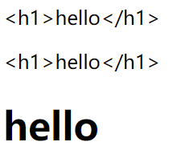
## 属性渲染指令

v-bind 简写为：

单向绑定：即数值变化可以同步到页面上，但是页面上的变化没法改变数值

```vue
<div id="app">
        <input type="text" :placeholder="tips">
    /*注意啊这里不需要{{tips}}*/
    </div>
    <script>
        const vm = new Vue({
            el:"#app",
            data:{
                tips:"请输入用户名"
            }
        });
    </script>
```

运行结果：
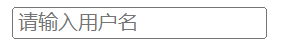

在vue提供的渲染模板语法中，除了支持绑定简单的数值外，还支持js表达式的运算，比如
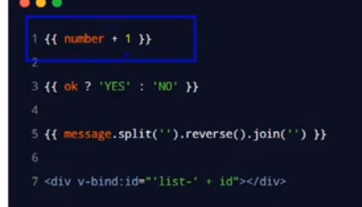
字符串拼接得这样写，其中box是字符串，index是data里面定义的
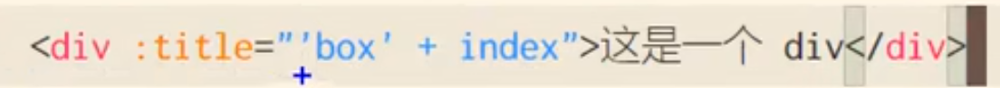

```
注意：在{{}}里面只能写简单的js表达式，不能写if等复杂的js语句
```
## 事件绑定指令

v-on简写为@

点击事件就是@click，键盘事件就是@keyup,输入框的输入事件@input

无参数版

```vue
 <div id="app">
        <p>值为：{{num}}</p>
        <button @click="add">加一</button>
        <button @click="cut">减一</button>
    </div>
    <script>
        const vm = new Vue({
            el:"#app",
            data:{
                num:0,

            },
            methods:{
                add(){
                    // vm.num++;
                    this.num++;//这里this指向vm
                },
                cut(){
                    // vm.num--;
                    this.num--;
                }
            }
        });
    </script>
```

带参数版

```vue
<div id="app">
        <p>值为：{{num}}</p>
        <button @click="add(2,$event)">加一</button>
    //这个event不能换
        <button @click="cut">减一</button>
    </div>
    <script>
        const vm = new Vue({
            el:"#app",
            data:{
                num:0,

            },
            methods:{
                add(n,e){
                    // vm.num++;
                    this.num+=n;
                    e.target.innerHTML="加"+n
                    //e。target代表那个button按钮
                },
                cut(){
                    // vm.num--;
                    this.num--;
                }
            }
        });
    </script>
```
### 事件修饰符

阻止默认行为

`e.preventDefault();`

或者

`<a href="http://www.baidu.com" @click.prevent="show">跳转到百度</a>`
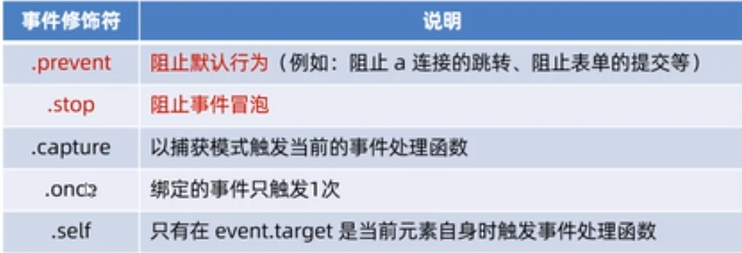
掌握前两个就行

冒泡就是比如有两个盒子，都绑定了点击事件，那么你点击里面的盒子，他就会先执行里面盒子的点击事件再冒泡执行外面盒子的点击事件

阻止事件冒泡：`e.stopPropagation()`或者`<a href="http://www.baidu.com" @click.stop="show">跳转到百度</a>`

## 双向绑定

v-model

就是说属性值改变，页面里对应的值也改变，页面的值改变也可以同步改变属性值

v-model只能用于表单那边，比如

input输入框，textarea，select

v-model的修饰符
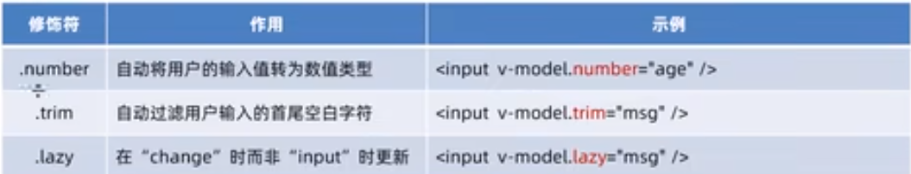
最后一个就是等她失去焦点之后同步他最后的结果，中间的变化过程都不管

## 条件渲染

v-if

v-show

两个的用处都是用于控制dom元素的显示和隐藏

区别：v-if是如果值为false，那么他是动态删除该标签,true就动态创建回来，而v-show是如果值为false，把标签的属性变成display:none，true的话去掉这个属性

性能方面：如果要频繁的切换元素的显示状态，v-show的性能好；如果刚进入页面的时候，某些元素默认不需要被显示，后期这个元素也很可能不用显示出来，此时v-if性能好

### v-if配套的指令
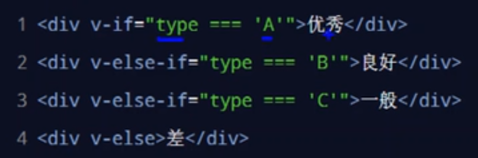
v-else-if要配合v-if使用，不然不会被识别

## 列表渲染
```
v-for

v-for="(item,index) in items"
```
第一个是数据，第二个是索引，如果不需要就不写index了

官方推荐只要用到v-for指令，要绑定一个 :key=值，而且尽量把id作为key的值，不要用index，key的值有要求，必须是字符串或者数字，key的值不允许重复，不然会报错

# 过滤器（只能用于vue2）

作用：用于文本的格式化，可用在两个地方：插值表达式和v-bind属性绑定

过滤器应该被添加到js表达式的尾部，由管道符  |  进行调用

本质：一个函数，调用过滤器之后我们看见的是过滤器的返回值

过滤器函数必须定义到filters里面，一定要有返回值

## 私有过滤器和全局过滤器

定义在vm里面的都属于私有过滤器

全局过滤器的定义方法：
```
Vue.filter('xxx',function)
```
第一个参数是全局过滤器的名字，第二个参数是处理函数

注：如果私有过滤器和全局过滤器名字一样，按照就近原则调用私有过滤器
```
如果有多个过滤器，比如{{name | f1 | f2| f3}}这种，就是先把name的值交给f1，然后再把f1返回的值交给f2以此类推

过滤器还可以传递参数，在filter里面第一个参数的位置永远是|前面那个，所以参数要在第二个往后接收
```
# 侦听器

## watch侦听器

```vue
监视数据变化然后做相应处理的，本质上是一个函数

侦听器要定义到watch：{}里面，要监听谁就把谁作为函数
<div id="app">
        <input type="text" v-model="username">
    </div>
    <script>
        const vm = new Vue({
            el:"#app",
            data:{
                username:''
            },
            watch:{
                username(newValue,oldValue){
                    //操作
                }
            }
        });
    </script>
```

## 侦听器的格式

1、方法格式的侦听器

缺点：无法再刚进入页面的时候自动触发，

如果侦听的是一个对象，如果对象中属性发生了变化，不会触发侦听器
```
username（newValue,oldValue）
```
2、对象格式的侦听器

好处：可以通过immediate选项，让侦听器自动触发，

可以通过deep选项，让侦听器深度监听对象中每个属性的变化
```
username：{

handler(newValue,oldValue){},

immediate:true

//true表示刚进入页面的时候自动触发，false表示刚进入页面的时候不触发

}
```
## 深度侦听

用deep：true来进行深度监听，记得双向绑定的数据要改成对象.属性值

```vue
<div id="app">
        <input type="text" v-model="info.username">
    </div>
    <script>
        const vm = new Vue({
            el:"#app",
            data:{
                info:{
                    username:'admin'
                }
            },
            watch:{
                //这样写没法侦听到username的变化
                // info(newValue){
                //     console.log(newVal);
                // }

            // 深度侦听的做法
              info:{
                handler(newValue){
                    if(newValue === '')return 
                   var url='https://www.escook.cn/api/finduser/' + newValue;
                   axios.get(url).then(function(res){
                       console.log(res);
                   })
                
                },
                deep:true
              }
               
            }
        });
    </script>
```
# 计算属性

指通过一系列运算后，最终得到一个属性值

写在```computed：{}```那边

计算属性在定义的时候要定义成一个函数，在使用他的时候，把他当成一个属性使用就行

好处：实现了代码复用，只要计算属性中依赖的数据源变化了，计算属性就会重新求值

代码详见31.html

# 创建vue项目

指令

在终端下运行如下的命令，创建指定名称的项目：

```vue create 项目名称```

运行，一定要先切换到项目文件里面，然后```npm run dev```

# 组件

Vue实例中的 ```.$mount()```方法作用和el属性完全一样

## 组件的三个组成部分

每个.vue组件都由3部分构成，分别是：template  模板  script js代码 style 样式

其中sytle部分就跟css一样，script部分要先默认写一个```export default{}```然后js代码写在里面

在组件中，this表示当前组件的实例对象

```vue
<template>
	<div></div>
</template>

<script>
export default{
	data(){
        return{
            username:'hahha'
        }
    },
    methods:{
        
    }
}
</script>

<style>

</style>
```

注意：.vue组件中的data不能像之前那样，不能指向对象，组件中的data必须是一个函数，然后return一个数据对象。其他的什么侦听器，计算属性，事件等写法跟之前一样

组件只能包含唯一的一个根节点，意思是不能在一个template中出现两个平级的div，解决方案，把这两个平级的div用一个大的div包裹起来就行

在style中。如果要启用less来写样式的话，要写```<style lang="less">```

## 组件之间的父子关系

组件在被封装好之后，彼此之间是相互独立的，不存在父子关系

在使用组件的时候，根据彼此的嵌套关系，形成了父子关系，兄弟关系

## 使用组件的三个步骤

1、使用import语法导入需要的组件 

2、使用components节点注册组件

3、以标签形式使用刚才注册的组件
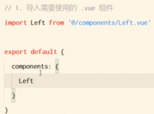
要在哪个vue文件中用，就在哪个vue文件那边导入

通过components注册的是私有子组件

## 注册全局组件

在vue项目的main.js入口文件中，通过Vue.component()方法，可以注册全局组件
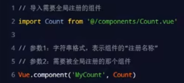
组件名称尽量都是大写开头

在自己的组件里面没法使用自己

## 组件里面的props

如果这个事件函数里面只有一行代码，也可以这么写
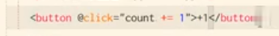
props的作用的提升代码的复用性，语法如下：
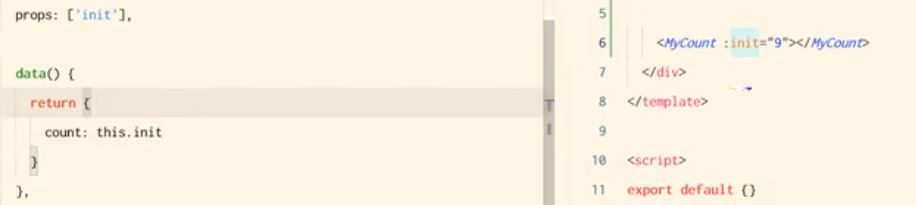
```
注意啊，如果你的数据是数字且要进行四则运算，一定要写成 :init="9"这种v-bind的形式，如果传的是字符串，也要加 ：
props中的数据可以在template中{{init}}这样使用，但是他是只读的，所以不要拿它去做任何运算
```
### props的default默认值

把props变成一个对象，default属性用于如果用户没有定义init属性就把值变成默认的default值
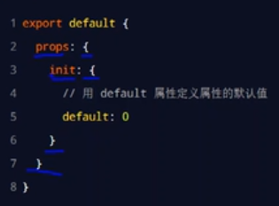
### props的type值类型

用type属性定义属性的值类型，如果传递过来的值不符合要求就会报错

```vue
props：{
	init:{
		default:0,
		type:Number
		//或者Object String
	}
}
```

### props的required必填项

就是谁用这个组件，谁必须传值给我，不然就会报错

```vue
props：{
	init:{
		default:0,
		type:Number,
		//或者Object String
		required:true
	}
}
```

## 组件之间的样式冲突问题

默认情况下，写在.vue组件中的样式会全局生效，因此很容易造成多个组件之间的样式冲突问题。

导致组件之间样式冲突的根本原因是：

1、单页面应用程序中，所有组件的dom结构，都是基于唯一的index.html页面进行呈现的

2、每个组件中的样式，都会影响整个index.html页面中的dom元素

解决方法：

1、给统一组件的标签都加上一个相同的属性，然后写样式的时候写标签[属性]这样

2、在style里面写一个scoped（用这个）
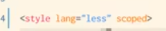
## /deep/样式穿透

 用于在父组件中直接改造子组件的样式，当使用第三方组件库的时候，如果有修改组件默认样式的需求，就需要用到这个

在style中要改变的对应标签前面加/deep/空格 标签名

## 组件的生命周期

——除了3个常用的，其他的了解一下就行

生命周期是指一个组件从创建——运行——销毁的整个阶段，强调的是一个时间段 
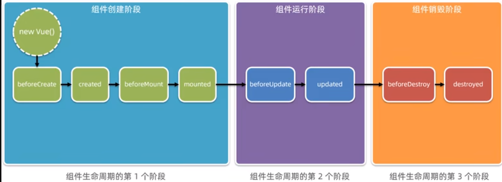
beforeCreate  组件的props/data/methods尚未被创建，都处于不可用状态

created   组件的props/data/methods已创建好，都处于可用的状态，但是组件的模板结构尚未生成，不能创建dom（**重要，在这里要发起ajax请求**）

beforeMount 将要把内存中编译好的html结构渲染要浏览器中，此时浏览器中还没有当前组件的dom结构

mounted 已经把内存中的html结构成功的渲染到了浏览器中，此时浏览器中已然包含了当前组件的dom结构(**最早操作dom元素**)

beforeUpdate 将要根据变化过后、最新的数据，重新渲染组件的模板结构

updated 已经根据最新的数据，完成了组件dom结构的重新渲染（**重**）

beforeDestroy 将要销毁此组件，此时尚未销毁，组件还处于正常工作的状态

destroyed 组件已经被销毁，此组件在浏览器中对应的dom结构已经被完全移除

## 组件之间的数据共享

如果父组件中要使用子组件，那么对于table下的tr，select下的option。ul里的li，ol里的li这种，要用is
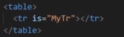
其中MyTr就是你想在tr里面使用的组件名

### 父向子传值

用**自定义属性** Props

父组件只负责提供数据，props写在子组件中

注意：不要在子组件中修改props里面的数据

### 子向父传值

使用**自定义事件** $emit('事件名',要传递的数据)，其中需要在父组件中先定义一个值用于传输子组件传递过来的值，然后还要再父组件中绑定这个自定义事件然后定义一个methods

### 兄弟组件之间的数据共享

在vue2中EventBus（**面试问得多**）

首先在接收数据方定义一个属性，用于接收传递过来的数据
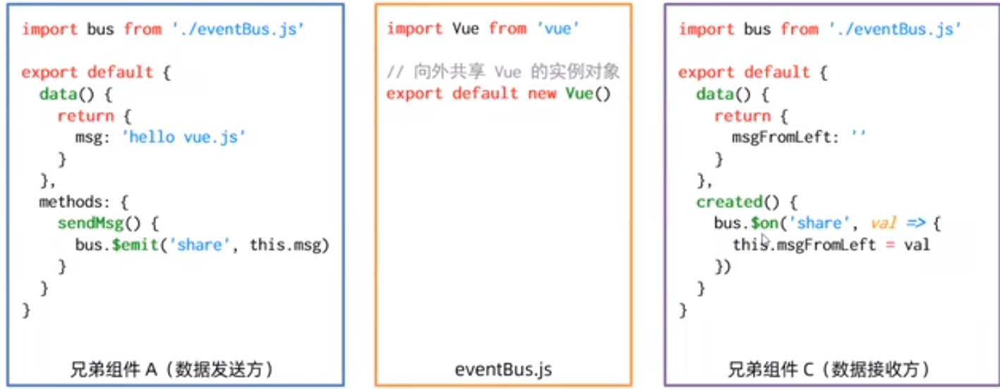
使用步骤

1、创建eventBus.js模块（自己建一个），并向外共享一个Vue的实例对象

2、在数据发送方，import js文件，调用bus.$emit('事件名称',要发送的数据)方法触发自定义事件

3、在数据接收方，import js文件，调用bus.$on('事件名称',事件处理函数)方法注册一个自定义事件

## 动态组件

指动态切换组件的显示与隐藏

vue提供了一个内置的```<component>```组件（可以认为是一个占位符），专门用来实现动态组件的渲染

语法：```<component is="组件名"></component>```

如果你不想写死的话就是在data（）里面定义一个变量，然后

```<component :is="变量名"></component>```

当组件被隐藏时，其实是组件被销毁了，然后再次出现是重新创建

### keep-alive

如果要做到离开这个组件的时候不要被销毁，用keep-alive保持状态，原理是当这个组件出现的时候被激活然后当这个组件隐藏的时候被缓存。
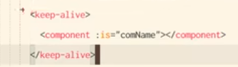
把你要保存的那个组件放在keep-alive里面。

### keep-alive对应的生命周期函数

当组件被缓存时，会自动触发组件的deactivated生命周期函数

当组件被激活时，会自动触发组件的activated生命周期函数

当组件第一次被创建的时候，顺序是先执行created，然后再执行activated，后面是只执行activated

注：上面这两个，要用了keep-active后才能使用

### keep-alive的include属性

include属性用来指定：只有名称匹配的组件会被缓存。多个组件名之间使用英文的逗号分隔
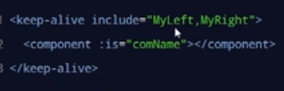
exclude排除项，写在这边的组件不会被缓存。注意：include和exclude不能同时使用

## 组件注册名称和声明name名称的区别

如果在声明组件（比如Left.vue里面）的时候，没有为组件指定name名称，则组件的名称默认就是注册时候的名称（比如App.vue里面component写的那个名）

当你在组件声明的时候设了name名称之后，组件就是这个名
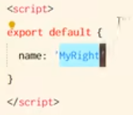
我们设置注册名称只是为了要让我们可以以标签的方式去使用这个组件。

组件声明时设置的name名称主要用于keep-alive标签实现组件缓存功能，以及在调试工具中看到组件的name名称

# ref引用

获取dom元素或组件的引用

每个vue的组件实例上，默认有一个$refs对象，里面存储着对应的dom元素或组件的引用。默认情况下，组件的$refs指向一个空对象

首先你要获取dom，就在这边给他加一个ref属性
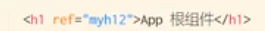
操作dom
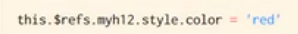
他也可以获取组件的引用：

先给这个组件加一个ref属性
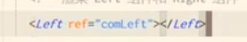
然后操作这个组件的属性和方法跟操作dom一样

this.$refs.名字.你想用啥

# this.$nextTick(回调函数)

等组件的dom重新渲染好之后再调用回调函数，从而保证回调函数可以操作到最新的数据

# 插槽

插槽是vue为组件的封装者提供的能力，允许封装者在封装组件时，把不确定的，希望由用户指定的部分定义为插槽

用```<slot></slot>```标签作为占位符，(比如写在left.vue里面)到时候用这个组件的时候写进以组件名为标签名的标签的时候就会把标签里面的内容（写在app.vue里面）渲染到这个占位符这里。

vue官方规定，每一个slot插槽，都要有一个name名称，如果省略，默认```name="default"```。默认情况下，在使用组件（在app.vue里面）的时候，提供的内容都会被填充到名字为default的插槽之中。

## v-slot指令

——简写为 #

如果我们要指名道姓告诉vue我要把这个内容放在哪个插槽中，用v-slot：插槽名字，语法格式如下：
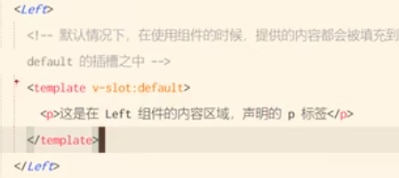
v-slot不能直接用在元素身上，必须用在template标签上

template这个标签是一个虚拟的标签，只起到包裹性质的作用，但是，不会被渲染为任何实质性的html标签

## 后备内容

如果我们用户没有指定插槽位置要放什么，我们要指定一个默认的内容的话，直接写在slot标签中间就行

## 具名插槽

就是给slot插槽加一个name，name为default的叫做默认插槽

## 作用域插槽
```
指在封装组件时，为预留的<slot>提供属性对应的值。

通过插槽的定义，我们可以拿到传过来的值（相当于子传父）

标准写法是接收参数的都叫做scope，然后如果我们要拿到传递的那个参数，就是{{score.msg}}
```
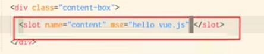
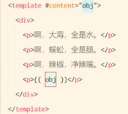
也可以用解构赋值
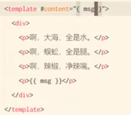
# 自定义指令

分为私有自定义指令和全局自定义指令

## 私有自定义指令

在组件的script那边定义，跟定义data啊，el啊这种一样，在directives节点下声明。里面的el是固定的。
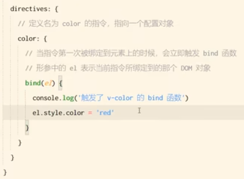
这样定义之后这个指令的名称就叫做v-color
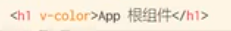
这样用完之后，这个h1标签里面的文字就会变成红色

也可以是```<h1 v-color="hhh">哈哈哈</h1>```

这样bind里面有两个参数bind(el,binding)

**第一个参数是当前指令所绑定的dom对象，就是h1。如果要获取到用户通过指令传递过来的hhh的值，就用binding.value就可以拿到**
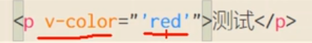
这种是写死的，就是我要传递的就是red，而上面那种写法是传一个参数，他回去data里面找有没有叫hhh的属性

bind元素的缺点：这个只在指令第一个绑定到元素上面的时候才能触发

### update函数

也是有两个参数，el和binding，含义一样的

update函数会在每次dom更新时被调用

这个也是写在directives，跟bind函数平级

bind和update都必须要有

### 函数简写

如果bind和update函数中的逻辑完全相同。则可以把指令写成函数形式

## 全局自定义指令

写在main.js文件中

简写版本：

`Vue.directive('指令名',function(el,binding){ 业务逻辑})`

全写版本：
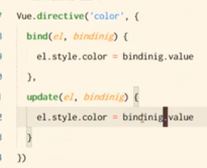
代码里面的提示
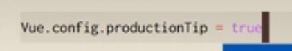
这个true的情况下，你可以看见那个温馨提示，提示你项目要上线的时候需要改模式，如果你改为false，那么你看不见那个提示。默认为true，就是你不写这行代码也是true

# eslint

用于约束代码规范

官方文档https://eslint.bootcss.com/

# axios

## 安装axios的命令

npm i axios -S

## 在vue里面使用axios发请求

首先要`import axios from 'axios'`

然后在methods里面发请求，语法跟在js里面一样

```vue
<script>
export default{
	methods:{
		async getInfo(){
			const(data:res)=await axios.get('')
				console.log(res)
		}
	}
}
</script>
```

## 把axios挂载到vue的原型上并配置请求根路径

在main.js里面写`import axios from 'axios'`

`axios.defaults.baseURL='请求根路径'`

`Vue.prototype.$http=axios`

写完上面这个之后就不需要在每个组件里面都写import了，代码改为

```vue
<script>
export default{
	methods:{
		async getInfo(){
			//只改了这一行的this
			const(data:res)=await this.$http.get('')
				console.log(res)
		}
	}
}
</script>
```

缺点：没法实现接口的复用

# 路由

## 前端路由的工作方式

1、用户点击了页面上的路由链接

2、导致了URL地址栏中的hash值发生了变化

3、前端路由监听到了Hash地址的变化

4、前端路由把当前Hash地址对应的组件渲染到浏览器中

## vue-router

路由解决方案，只能在vue中使用

官方文档vue2版

https://v3.router.vuejs.org/zh/

安装

npm i vue-router@3.5.2 -S

在main.js里面写

import router from '@/router/index.js'

然后在原有的new Vue({

里面加上这行 router

})

在main.js里面写

```vue

import VueRouter from 'vue-router'

Vue.use(VueRouter)

const router = new VueRouter()

export default router

```

在进行模块化导入的时候，如果给定的是文件夹，默认导入这个文件夹下，名字叫做index.js的文件

## router-view

<router-view></router-view>

作用：占位符，写在app.vue里面

routes是一个数组，作用：定义哈希地址与组件之间的关系

path里面#就不用写了，写#后面的
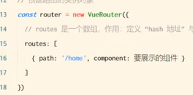
写在index.js里面，记得那个component后面的那个内容要先import

## router-link代替a标签

`<a href="#/home">首页</a>`

`<router-link to="/home">首页</router-link>`

注意：写这个to后面那个是地址，好处是不用写#

## 路由重定向

指用户在访问地址A的时候，强制用户跳转到地址C，从而展示特定的组件页面，通过路由规则的redirect属性，指定一个新的路由地址，可以很方便地设置路由的重定向

```vue
routes:[
	{path:'/',redirect:"/home"}
]
```

常用于重定向/这个，这样用户一上来就不会看见一个空页面

## 嵌套路由

通过路由实现组件的嵌套展示

``````

如果要这样的话，那么那个tab1，tab2两个router-link要写在about.vue文件中，并且写一个占位符router-view

## 通过children属性声明子路由规则

写在index.js里面

```vue
import tab1 from xxx
import tab2 from xxx
const router =new VueRouter({
	routes:[{
		path:"/about"
		component:About,
		children:[
			{path:'tab1',component:tab1},
			{path:'tab2',component:tab2}
	//斜线不用写
		]
	}]
})
```

## 默认子路由

比如我想点击about的时候自动跳转到about/tab1

法一：用redirect设置默认路由地址

那我就去找about的路由在哪里，然后在path后面加一个redirect属性，值等于about/tab1

法二：默认子路由

所谓默认子路由是指如果children数组中，某个路由规则的path值为空字符串，则这条路由规则，叫做默认子路由。

只要有空字符串就表示，只要我一点击about，他就会自动跳转到响应组件

```
import tab1 from xxx
import tab2 from xxx
const router =new VueRouter({
	routes:[{
		path:"/about"
		component:About,
		children:[
			{path:'',component:tab1},
			{path:'tab2',component:tab2}
	//斜线不用写
		]
	}]
})
```

如果你写默认子路由的话，那么你之前写的那个router-link也要改
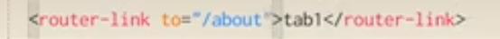
## 动态路由匹配

动态路由是指，把哈希地址中可变的部分定义为参数项，从而提高路由规则的复用性。

在vue-router中使用 ：来定义路由的参数项

比如：

```vue
{path:'/movie/:id',component:Movie}
```

在Movie组件中拿到动态参数id的值

法一：

`this.$route.params.id`

this可以省略，this.$route是路由的参数对象

法二：

用props传参

```
{path:'/movie/:id',component:Movie,props:true}
然后在movie组件的export default里面写入props:['id']

所以我要使用到id的时候直接就{{id}}
```

```
<router-link to="/movie/1?name=zs age=20"
```

在哈希地址中 ？后面的参数项叫做查询参数。获取到？后面的参数值用`this.$route.query`

this.$route里面fullPath是完整的路径，包含？后面传递的参数，path就只是路径而已，不带参数

# 导航

## 声明式导航

在浏览器中，点击链接实现导航的方式，叫做声明式导航

普通网页中点击```<a>```链接，vue项目中点击```<router-link>```都属于声明式导航

## 编程式导航

在浏览器中，调用API方法实现导航的方式，叫做编程式导航。例如：普通网页中调用location.href跳转到新页面的方式，属于编程式导航

在vue项目中，vue-router提供了许多编程式导航API，最常用的为：

`this.$router.push('哈希地址')`

跳转到指定的哈希地址，并增加一条历史记录

`this.$router.replace('哈希地址')`

跳转到指定的哈希地址，并替换掉当前的历史记录

`this.$router.go(数值n)`

在浏览历史中前进和后退（负数表示后退，整数表示前进）

如果次数达到上限则原地不动

在实际开发中，由于我们一般只会前进或后退1个页面，所以$router.go有一个快捷写法
```
$router.back() 后退

$router.forward() 前进
```
注意：后面这两个不用写this

## 导航守卫

可以控制路由的访问权限

### 全局前置守卫

每次发生路由的导航跳转时，都会触发全局前置守卫，就是那个fn

写在index.js里面
```
const router = new VueRouter({.....})

router.beforeEach(function(to,from,next){......})
```
### 守卫方法的3个形参

to 将要访问的路由的信息对象

from 将要离开的路由的信息对象

next 是一个函数，调用next（）表示放行，允许这次路由导航，必写

### next函数的3种调用方式

当前用户拥有后台主页的访问权限，直接放行，next（）

当前用户没有后台主页的访问权限，强制其跳转到登录页面next（'/login')

当前用户没有后台主页的访问权限，不允许跳转到后台主页，强制用户停留在当前页面，哪也不去

next(false)

### 控制后台主页的访问权限

```vue
router.beforeEach(function(to,from,next){
	//假设main页面是后台
	if(to.path === '/main'){
		const token = localStorage.getItem('token');
		if(token){
			next();//访问的是后台，并且有登录
		}else{
			next('/login');//访问后台，但是没登录
		}
	}else{
		next();//不是要访问后台，不需要登录，直接放行
	}
})
```
