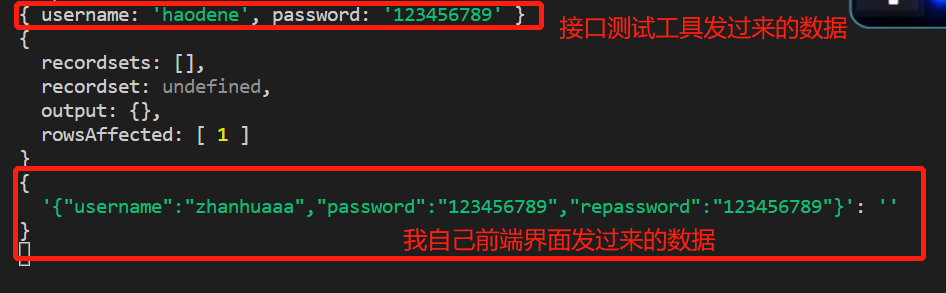
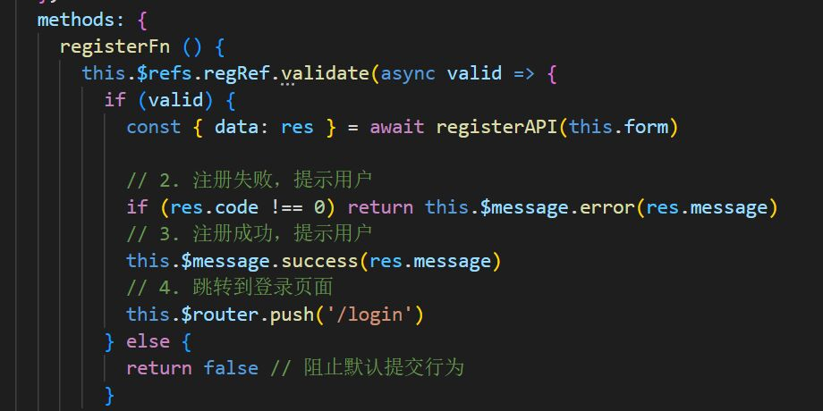
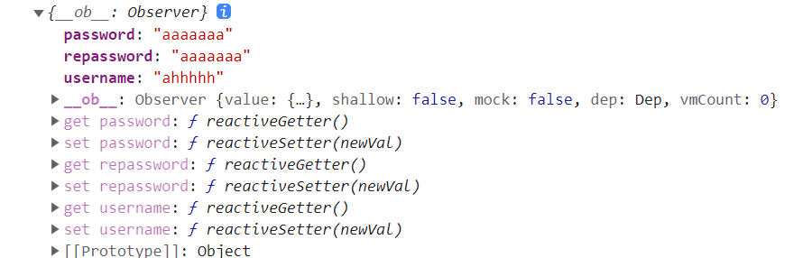
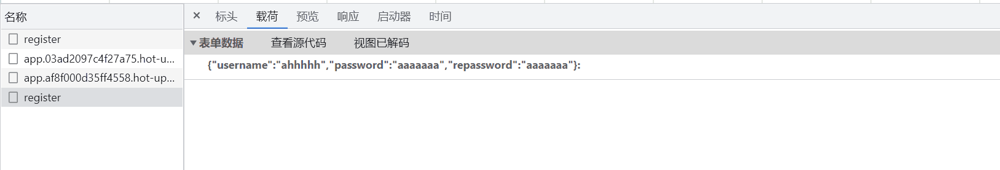

这几天一直在用node.js写接口，一方面是为了理解前后端交互的过程，一方面是为了了解后端的代码逻辑和数据库交互过程，由于我的MySQL用到的工具DataGrip过期了，所以只能用SqlServer做数据库。。。巨坑由此接踵而来

首先是数据库连接与读取数据，笔者之前用过Python连接过SqlServer，也了解过mysql与数据库的连接与查询，可遇到node连接SqlServer却一直无法成功，上网查了好几个版本的代码终究还是无法解决。。。刚开始是连不上数据库，后来是由于SqlServer的读取数据语法跟mysql有点区别，所以用mysql的语法一直走不通，各种报错，经过一夜的不懈尝试，终于成功了，成功版本的代码如下：
### 连接数据库
```js

let sql = require('mssql');

let dbConfig = {
  user: '用户名（默认sa）',
  password: '密码',
  server: 'localhost',
  database: '数据库名',
  port: 1433,
  pool: {
      max: 10,
      min: 0,
      idleTimeoutMillis: 60000
  },
  options: {
    trustedConnection: true,
    encrypt: false,
    enableArithAbort: true,
    trustServerCertificate: false,

  },
};
```
### 使用数据库
这边以注册为例分享可以成功使用的代码
```js
const { sql, dbConfig } = require('../db/index')

// 注册的处理函数
exports.register = (req, res) => {
    // 获取客户端提交给服务器的用户信息
    const userinfo = req.body

    // 判断用户名和密码是否为空
    if (!userinfo.username || !userinfo.password) {
        return res.send({ status: 1, message: '用户名或密码不能为空' })
    }
    // 检验用户名是否被占用

    sql.connect(dbConfig, function (err) {  //连接数据库
        if (err) {
            console.log('连接数据库失败');
            return;
        } else {
            var request = new sql.Request();
            var UserName = userinfo.username
            var password = userinfo.password
            var sqlstr = "select * from users where username='" + UserName + "'"
            
            request.query(sqlstr, function (err, results) { //执行查询语句			
                if (err) {
                    console.log('查询失败：' + err);
                    return res.send({ status: 1, message: err.message })
                }
               
                if (results.recordset.length > 0) {
                    return res.send({ status: 1, message: '用户名被占用，请重新输入用户名' })
                }
            
                // 定义插入新用户的SQL语句
                const sqlstr2 = "insert into users (username,password) values ('"+ UserName + "','"+ password +"'"+")"
                request.query(sqlstr2, (err, results) => {
                    console.log(results);
                    // 判断SQL语句是否执行成功
                    if (err) return res.send({ status: 1, message: err.message })
                    // 判断影响行数是否为1
                    if (results.rowsAffected[0] !== 1) return res.send({ status: 1, message: '注册用户失败，请稍后再试' })
                    // 注册成功
                    res.send({ status: 0, message: '注册成功' })
                })


            });
            sql.end;
        }
    })
   
}
```
这样，这个连接问题就解决了，但是随着而来的是另一个问题：<strong>SQL注入</strong>
### 何为SQL注入
SQL注入是一种web安全漏洞，主要形成原因是在数据库交互中，传入的数据拼接到SQL语句中后，被当做SQL语句的一部分执行，从而导致数据库受损。

在我上述代码中，产生这种现象的原因就是因为我SQL语句写的时候用的是拼接字符串的形式，且我前面没做任何校验就把这些数据送进SQL语句执行。
最终有大佬建议我用 sequelize 来做 ORM 库，不要轻易的做拼接SQL语句。
https://sequelize.org/docs/v6/core-concepts/model-querying-basics/#the-basics

这个问题之后，又迎来了下一个问题，这次不是接口的错，是前端传递参数的时候格式不正确



这是我的原始代码，
前端接口写的```this.form``` 传递的是我data里面收集到的表单对象，通过log一下这个和看了一下浏览器发的请求信息发现了不对劲


在第二张照片中可以看出，在前端传递数据的时候就已经把他变成键了
最后的解决方案是：把```this.form```改成```JSON.parse(JSON.stringify(this.form))```


最后的最后，感谢在遇到问题的时候那些为我解答和指出漏洞的陌生人们！！！


